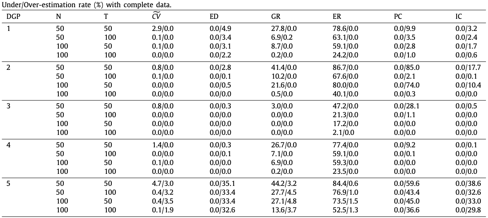
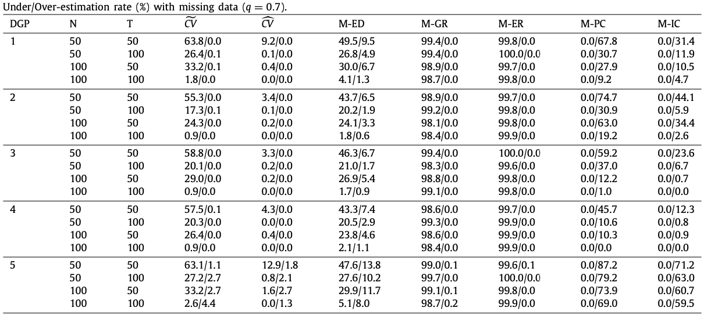
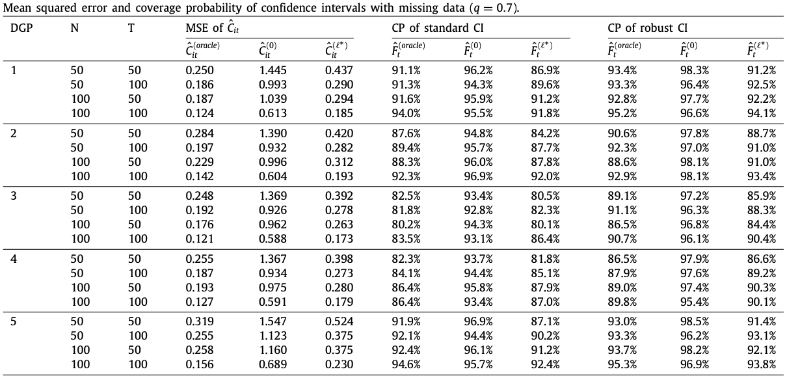
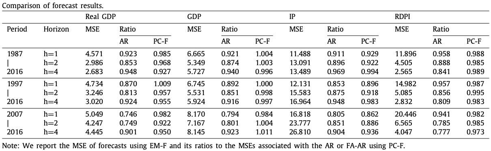



# On factor models with random missing: EM estimation, inference, and cross validation

$$
\begin{aligned}
\\
\end{aligned}
$$

 Li Zhe 

$$$$

School of Data Science, Fudan University 
 

$$$$

November 30, 2023

---



## Outline

- Background: **factor model**
- Motivation
- Factor models with random missing:
  - EM estimator
  - Asymptotic properties
  - Determining the number of factors
- Simulation
- Empirical application

--- 


## Background: factor model

$$
\begin{aligned}
x_{i t} & =\lambda_i f_t+e_{i t} \\\
\boldsymbol{X} &= \boldsymbol{\Lambda} \boldsymbol{F}^\top + \boldsymbol{E}
\end{aligned}
$$
- $\boldsymbol{X}=(\boldsymbol{x}_{\cdot 1},\ldots,\boldsymbol{x}\_{\cdot T})\in\mathbb{R}^{N\times T}$
- $\boldsymbol{\Lambda}\in\mathbb{R}^{N\times R}$: factor loadings
- $\boldsymbol{F}\in\mathbb{R}^{T\times R}$: common factors (latent, unobserved)
- $\boldsymbol{E}\in\mathbb{R}^{N\times T}$: idiosyncratic (or error) component
  - $\{e_{it}\}$ can exhibit both cross-sectional and temporal dependence.

- Given the factor number $k$, we can estimate the factors and factor loadings by
$$
\Big\\{\widehat{\boldsymbol{\Lambda}}^k, \widehat{\boldsymbol{F}}^k\Big\\}=\arg\min\_{\boldsymbol{\Lambda}^k,\boldsymbol{F}^k}\frac{1}{NT}\Big\\|\boldsymbol{X}- \boldsymbol{\Lambda}^k{\boldsymbol{F}^k}^\top\Big\\|_F^2
$$
where $\boldsymbol{\Lambda}^k\in\mathbb{R}^{N\times k}$ and $\boldsymbol{F}^k\in\mathbb{R}^{T\times k}$.
--- 



## Motivation

- Factor model in balanced panel has been thoroughly investigated.
$$$$
- How to handle the missing data problem in factor models?
$$$$
  - the expectation–maximization (EM) algorithm
$$$$
  - the Kalman filter (KF)
$$$$
- There is no formal study of the **asymptotic properties** for the EM estimators of the factors and factor loadings for the PC estimation with <mark>missing observations</mark>

---



## Notations

- consider the factor model
$$
\boldsymbol{X} =  \boldsymbol{F}\boldsymbol{\Lambda}^\top + \varepsilon
$$
  - $\boldsymbol{X}=(X_1,\ldots,X_N)$ where $X_i \equiv\left(X_{i 1}, \ldots, X_{i T}\right)^{\prime}$ and $X_{it}$ are  **missing at random** 
  - $\varepsilon=\left(\varepsilon_1, \ldots, \varepsilon_N\right)$ and $\varepsilon_i \equiv\left(\varepsilon_{i 1}, \ldots, \varepsilon_{i T}\right)^{\prime}$ for $i=1, \ldots, N$.
  - $F=\left(F_1, \ldots, F_T\right)^{\prime}$ and $\Lambda=\left(\lambda_1, \ldots, \lambda_N\right)^{\prime}$ where $F_t$ and $\lambda_i$ are $R \times 1$ vectors of factors and factor loadings
- $F^0=\left(F_1^0, \ldots, F_T^0\right)^{\prime}$ and $\Lambda^0=\left(\lambda_1^0, \ldots, \lambda_N^0\right)^{\prime}$ are the true values of $F$ and $\Lambda$
- $\Omega \subset[N] \times[T]$ be the index set of the observations that are observed. That is,
$$
\Omega=\Big\\{(i, t) \in[N] \times[T]: X_{i t} \text { is observed }\Big\\}.
$$

- Let $G$ denote a $T \times N$ matrix with $(t, i)$ th element given by $g_{i t}=\mathbf{1}\\{(i, t) \in \Omega\\}$ and is <mark>independent of $X, F^0, \Lambda^0$ and $\varepsilon$</mark>

---



## The initial estimates

- Let $\tilde{X}=X \circ G$ and $\tilde{X}\_{i t}=X\_{i t} g\_{i t}$.
- The common component $C^0 \equiv F^0 \Lambda^0$ is <mark>a low rank matrix</mark> $\Rightarrow$ it is possible to recover $C^0$ even when a large proportion of elements in $X$ are missing at random.
- Under the standard condition that $E\left(\varepsilon_{i t} \mid F_t^0, \lambda_i^0\right)=0$, we can verify that $E\left(\frac{1}{q} \tilde{X} \mid F^0, \Lambda^0\right)=F^0 \Lambda^{0 \prime}$ $\Rightarrow$ consider the following least squares objective function
$$
\mathcal{L}_{N T}^0(F, \Lambda) \equiv \frac{1}{N T} \operatorname{tr}\left[\left(\frac{1}{\tilde{q}} \tilde{X}-F \Lambda^{\prime}\right)\left(\frac{1}{\tilde{q}} \tilde{X}-F \Lambda^{\prime}\right)^{\prime}\right]
$$
**identification restrictions**: $F^{\prime} F / T=I_R$ and $\Lambda^{\prime} \Lambda$ is a diagonal matrix. 

- By concentrating out $\Lambda$ and using the normalization that $F^{\prime} F / T=I_R$ $\Rightarrow$ identical to maximizing $\tilde{q}^{-2} \operatorname{tr}\Big\\{F^{\prime} \tilde{X} \tilde{X}^{\prime} F\Big\\}$ 

---


## The initial estimates

- The estimated factor matrix, denoted by $\hat{F}^{(0)}$ is $\sqrt{T}$ times the eigenvectors corresponding to the $R$ largest eigenvalues of the $T \times T$ matrix $\frac{1}{N T \tilde{q}^2} \tilde{X} \tilde{X}^{\prime}:$
$$
\frac{1}{N T \tilde{q}^2} \tilde{X} \tilde{X}^{\prime} \hat{F}^{(0)}=\hat{F}^{(0)} \hat{D}^{(0)},
$$
  - $\hat{D}^{(0)}$ is an $R \times R$ diagonal matrix consisting of the $R$ largest eigenvalues of $\left(N T \tilde{q}^2\right)^{-1} \tilde{X} \tilde{X}^{\prime}$, arranged in descending order along its diagonal line.
- The estimator of $\Lambda^{\prime}$ is given by
$$
\hat{\Lambda}^{(0) \prime}=\frac{1}{\tilde{q}}\left(\hat{F}^{(0) \prime} \hat{F}^{(0)}\right)^{-1} \hat{F}^{(0) \prime} \tilde{X}=\frac{1}{T \tilde{q}} \hat{F}^{(0) \prime} \tilde{X} .
$$
- We can obtain an initial estimate of the $(t, i)$ th element, $C\_{i t}^0$, of $C^0$ by $\hat{C}\_{i t}^{(0)}=\hat{\lambda}\_i^{(0)\prime} \hat{F}\_t^{(0)}$. 
- The initial estimators $\hat{F}\_t^{(0)}, \hat{\lambda}\_i^{(0)}$ and $\hat{C}\_{i t}^{(0)}$ are consistent and follow mixture normal distributions under some standard conditions.

---


## The iterated estimates

- The initial estimators: consistency but <mark>not asymptotically efficient</mark> $\Rightarrow$ **iterative estimators**
- In step $\ell$, we can <mark> replace the missing values $\left(X_{i t}\right)$ in the matrix $X$ with the estimated common components $\hat{C}\_{i t}^{(\ell-1)}$</mark>. Define the $T \times N$ matrix $\hat{X}^{(\ell)}$ with its $(t, i)$ th element given by
$$
\hat{X}\_{i t}^{(\ell)}=\left\\{\begin{array}{ll}
X\_{i t} & \text { if }(i, t) \in \Omega \\\
\hat{C}\_{i t}^{(\ell-1)} & \text { if }(i, t) \in \Omega\_{\perp}
\end{array}, \ell \geq 1,\right.
$$
where $\Omega_{\perp}=\\{(i, t) \in[N] \times[T]:(i, t) \notin \Omega\\}$. 
- Then we can conduct the PC analysis based on $\hat{X}^{(\ell)}$ and obtain $\hat{F}^{(\ell) \prime}$ and $\hat{\Lambda}^{(\ell)}$. 
- We will study the asymptotic properties of $\hat{F}\_t^{(\ell)}, \hat{\lambda}\_i^{(\ell)}$ and $\hat{C}\_{i t}^{\left(\ell^{\ell}\right)}, \ell=1,2, \ldots$

$$
~\\\\\
~\\\\\
$$

---



## Asymptotic properties of the initial estimators

**Theorem 2.1.** Suppose some assumptions hold. Then 
$$\frac{1}{T}\Big\\|\hat{F}^{(0)}-F^0 \hat{H}^{(0)}\Big\\|_F^2=O_P\left({\color{red}\delta\_{N T}^{-2}}\right)$$ 
where $\delta\_{N T}=\sqrt{N} \wedge \sqrt{T}$.
- $\hat{H}^{(0)}$ is defined as 
$$
\hat{H}^{(0)}=\left(N^{-1} \Lambda^{0 \prime} \Lambda^0\right) T^{-1} F^{0 \prime} \hat{F}^{(0)}\left(\hat{D}^{(0)}\right)^{-1},
$$
where $\hat{D}^{(0)}$ is asymptotically nonsingular by Lemma A.1.

---



## Asymptotic distributions

**Theorem 2.2.** Suppose some assumptions hold. Suppose that $\left(T^{1 / 2}+N^{1 / 2}\right) \delta_{N T}^{-2}=o(1)$. Let $\hat{\Pi}\_{t N}^{(0)}=\sqrt{N}\Big(\hat{F}\_t^{(0)}-\hat{H}^{(0) \prime} F\_t^0\Big)$ and $\hat{\Pi}\_{i T}^{(0)}=\sqrt{T}\Big(\hat{\lambda}\_i^{(0)}-(\hat{H}^{(0)})^{-1} \lambda_i^0\Big)$. Then as $(N, T) \rightarrow \infty$
1. $\hat{\Pi}\_{t N}^{(0)}=\Big(\hat{D}^{(0)}\Big)^{-1} \frac{1}{T} \hat{F}^{(0) t} F^0 \frac{1}{\sqrt{N} q} \sum\_{i=1}^N \lambda\_i^0 \xi\_{i t}+O_P\Big(N^{1 / 2} \delta\_{N T}^{-2}\Big) \rightarrow N\Big(0, D^{-1} Q \Gamma\_{g, t}(q) Q^{\prime} D^{-1}\Big) \mathcal{G}^t$-stably,
2. $\hat{\Pi}\_{i T}^{(0)}=\hat{H}^{(0) \prime} \frac{1}{\sqrt{T} q} \sum_{t=1}^T F_t^0 \xi\_{i t}+O_P\left(T^{1 / 2} \delta\_{N T}^{-2}\right) \rightarrow N\left(0,\left(Q^{\prime}\right)^{-1} \Phi_{g, i}(q) Q^{-1}\right) \mathcal{G}^i$-stably,
3. $\Big(\frac{1}{N} \Sigma_{F, i t}^{(0)}(q)+\frac{1}{T} \Sigma\_{\Lambda, i t}^{(0)}(q)\Big)^{-1 / 2}\Big(\hat{C}\_{i t}^{(0)}-C\_{i t}^0\Big) \stackrel{d}{\rightarrow} N(0,1)$,

---



## Asymptotic properties of the iterated estimators

**Theorem 2.3.** Suppose some assumptions hold. Then 
$$\frac{1}{T}\Big\\|\hat{F}^{(\ell)}-F^0 \hat{H}^{(\ell)}\Big\\|^2=O_P\left(\delta_{N T}^{-2}\right)$$
for each $\ell$, where $\hat{H}^{(\ell)}$ is defined as 
$$
\hat{H}^{(\ell)}=\left(N^{-1} \Lambda^{0 \prime} \Lambda^0\right) T^{-1} F^{0 \prime} \hat{F}^{(\ell)}\Big(\hat{D}^{(\ell)}\Big)^{-1},
$$

---



## Asymptotic distributions

**Theorem 2.4.** Suppose some assumptions hold. Suppose that <mark>$\sqrt{N}\big(T^{\gamma_1 / 4} \delta_{N T}^{-2} \ln T+T^{-1+3 \gamma_1 / 4}\big)=o(1)$</mark> and <mark>$\sqrt{T}\big(N^{\gamma\_2 / 4} \delta\_{N T}^{-2} \ln N+N^{-1+3 \gamma\_2 / 4}\big)=o(1)$</mark>. Let $\hat{\Pi}\_{t N}^{(\ell)}=\sqrt{N}\Big(\hat{F}\_t^{(\ell)}-\hat{H}^{(\ell) \prime} F\_t^0\Big)$ and $\hat{\Pi}\_{i T}^{(\ell)}=\sqrt{T}\Big(\hat{\lambda}\_i^{(\ell)}-\hat{H}^{(\ell)-1} \lambda\_i^0\Big)$. Then
- $\hat{\Pi}\_{t N}^{(\ell)}=D^{-1} Q \frac{1}{\sqrt{N}} \sum\_{i=1}^N \lambda_i^0 \varepsilon\_{i t} g\_{i t}+(1-q) \hat{\Pi}\_{t N}^{(\ell-1)}+o_P(1)$ uniformly in $t$ and
$$
\hat{\Pi}\_{t N}^{(\ell)} \stackrel{d}{\rightarrow} N\left(0, D^{-1} Q {\color{red}\Gamma\_{1 g, t}(q)} Q^{\prime} D^{-1}\right) \text { as }(\ell, N, T) \rightarrow \infty
$$
- $\hat{\Pi}\_{i T}^{(\ell)}=\left(Q^{\prime}\right)^{-1} \frac{1}{\sqrt{T}} \sum\_{t=1}^T F_t^0 \varepsilon\_{i t} g\_{i t}+(1-q) \hat{\Pi}\_{i T}^{(\ell-1)}+o_P(1)$ uniformly in $i$ and
$$
\hat{\Pi}\_{i T} \stackrel{d}{\rightarrow} N\left(0,\left(Q^{\prime}\right)^{-1} {\color{red}\Phi\_{1 g, i}(q)} Q^{-1}\right) \text { as }(\ell, N, T) \rightarrow \infty,
$$
- $\left(\frac{1}{N} \Sigma\_{1 F, i t}+\frac{1}{T} \Sigma\_{1 \Lambda, i t}\right)^{-1 / 2}\left(\hat{C}\_{i t}^{(\ell)}-C_{i t}^0\right) \stackrel{d}{\rightarrow} N(0,1)$ as $(\ell, N, T) \rightarrow \infty$.

---



## Determining the number of factors via CV

- Given the $T \times N$ matrix of observations $X$: 
  - randomly sample elements in $X$ with a fixed probability $p \in(0,1)$
  - leave the rest $(1-p)$-proportion of observations as held-out entries for the out-of-sample evaluation.
- Let $\Omega^\star \subset[N] \times[T]$ be the index set of the training entries and $\Omega\_{\perp}^\star$ the index set of the held-out entries. 
- Define the operator $P\_{\Omega^\star}: \mathbb{R}^{T \times N} \rightarrow \mathbb{R}^{T \times N}$ by
$$
\left(P\_{\Omega^\star} X\right)\_{t i}=X\_{i t} g\_{i t}^\star=X\_{i t} \mathbf{1}\left\\{(i, t) \in \Omega^\star\right\\},
$$
where $g\_{i t}^\star=\mathbf{1}\left\\{(i, t) \in \Omega^\star\right\\}$. 
- Let $G^\star$ denote a $T \times N$ matrix with $(t, i)$ th element given by $g\_{i t}^\star$. 
- Now we can regard $P\_{\Omega^\star} X$ as the $T \times N$ data matrix with missing values replaced by zeros. 

---



## Determining the number of factors via CV

- Given $P\_{\Omega^\star} X$, we apply the proposed EM algorithm to recover the data via estimating the common component matrix $C$ for any given number of factors.
- To proceed, we consider the full singular value decomposition (SVD) for $\frac{1}{p} P\_{\Omega^\star} X$:
$$
\frac{1}{p} P_{\Omega^\star} X=\tilde{U} \tilde{\Sigma} \tilde{V}^{\prime}=\sum_{r=1}^{T \wedge N} \tilde{u}_r \tilde{v}_r^{\prime} \tilde{\sigma}_r,
$$
  - $\tilde{U}\in\mathbb{R}^{T \times T}=\left(\tilde{u}_1, \ldots, \tilde{u}_T\right)$
  - $\tilde{V}\in\mathbb{R}^{N \times N}=\left(\tilde{v}_1, \ldots, \tilde{v}_N\right)$
  - $\tilde{\Sigma}\in\mathbb{R}^{T \times N}$ is the diagonal matrix that contains the singular values, $\tilde{\sigma}\_1, \tilde{\sigma}\_2, \ldots, \tilde{\sigma}\_{T \wedge N}$, arranged in descending order along the main diagonal line. 
- Given any $R \leq T \wedge N$ and the training entries in $P_{\Omega^\star} X$, we can estimate the common component $C$ by the singular value thresholding procedure:
$$
\tilde{C}\_R=S\_H\left(\frac{1}{p} P\_{\Omega^\star} X, R\right)=\tilde{U}\_R \tilde{\Sigma}\_R \tilde{V}\_R^{\prime}=\sum\_{r=1}^R \tilde{u}\_r \tilde{v}\_r^{\prime} \tilde{\sigma}\_r,
$$
where $S_H(\cdot, R)$ is the rank-R truncated SVD of $\cdot$, t

---



## Determining the number of factors via CV

- Let $\tilde{C}\_{R, i t}$ denote the $(t, i)$ th element of $\tilde{C}\_R$ for $R \geq 1$. 
- We propose to choose $R$ to minimize the following CV criterion function
$$
{\color{red}\widetilde{C V}(R)=\frac{1}{N T} \sum\_{(i, t) \in \Omega\_{\perp}^\star}\left[X\_{i t}-\tilde{C}\_{R, i t}\right]^2.}
$$
- Let $\tilde{R}=\arg \min \_{0 \leq R \leq R_{\max }} \widetilde{C V}(R)$ where $R\_{\max }$ is a fixed integer that is no less than $R_0$

$$
~\\\\\
~\\\\\
~\\\\\
~\\\\\
~\\\\\
$$

---



## A more efficient method

-  Can we use the $\ell$-step estimator $\hat C\_{R,it}^{(\ell)}$ ?
- Suppose that we have obtained the estimates $\hat{C}\_{R, i t}^{(\ell-1)}$. In step $\ell$, we can replace the zero elements in $X^\star \equiv P\_{\Omega^\star} X$ with the estimated common components $\hat{C}\_{R\_{\max }, i t}^{(\ell-1)}$ 
- Define the $T \times N$ matrix $\hat{X}^{\star(\ell)}$ with its $(t, i)$ th element given by
$$
\hat{X}\_{i t}^{\star(\ell)}= \begin{cases}X\_{i t} & \text { if }(i, t) \in \Omega^\star \\\ \hat{C}\_{R\_{\max }^{(\ell-1)}}, & \text { if }(i, t) \in \Omega\_{\perp}^\star, \ell \geq 1,\end{cases}
$$
where $\Omega\_{\perp}^\star=\big\\{(i, t) \in[N] \times[T]:(i, t) \notin \Omega^\star\big\\}$
- Conduct the singular value thresholding procedure:
$$
\hat{C}\_R^{(\ell)}=S\_H\big(\hat{X}^{*(\ell)}, R\big)=\hat{U}\_R^{(\ell)} \hat{\Sigma}\_R^{(\ell)} \hat{V}\_R^{(\ell) \prime},
$$
- repeating the above procedure for $\ell=1, \ldots, \ell^\star \equiv\left\lfloor\ln \left(\epsilon_{N T}\right) / \log (p)\right\rfloor$
- Let $\hat{C}\_R=\hat{C}\_R^{(\ell^\star)}$ and $\hat{R}=\arg \min \_{0 \leq R \leq R\_{\max }} \widehat{C V}(R)$, where
$$
\widehat{C V}(R)=\frac{1}{N T} \sum_{(i, t) \in \Omega_{\perp}^\star}\left[X_{i t}-\hat{C}_{R, i t}\right]^2
$$

---



## The consistency of the CV method

**Assumption A.7.**
1. For $r=R\_{0+1}, \ldots, R\_{\max }, \\\ P\Big(\big\\|\tilde{u}\_r\big\\|\_{\infty}\big\\|\tilde{v}\_r\big\\|\_{\infty} \leq 1 /\big(c\_0 \sqrt{(N+T) \log (N+T)}\big)\Big) \rightarrow 1$ 
for some fixed $c\_0<\infty$ as $(N, T) \rightarrow \infty$, $\left\\|\tilde{u}\_r\right\\|\_{\infty}=o\_P(1)$, and $\left\\|\tilde{v}\_r\right\\|\_{\infty}=o_P(1)$
2. $\max \_{(i, t) \in \Omega\_{\perp}^\star} \sum\_{(j, s) \in \Omega\_{\perp}^\star}\left|E\left[\varepsilon\_{i t} \varepsilon\_{j s} \mid P\_{\Omega^\star} X, \Omega^\star\right]\right|=o\_P\left(\delta\_{N T}^2\right)$.

 **Theorem 3.1.**  Suppose some assumptions hold. Then $P\left(\tilde{R}<R_0\right) \rightarrow 0$ as $(N, T) \rightarrow \infty$. If Assumption A.7 also holds, then $P\left(\tilde{R}>R_0\right) \rightarrow 0$ as $(N, T) \rightarrow \infty$.

 **Theorem 3.2.**  Suppose some assumptions hold. Then $P\left(\hat{R}<R_0\right) \rightarrow 0$ as $(N, T) \rightarrow \infty$. If Assumption A.7 also holds, then $P\left(\hat{R}>R_0\right) \rightarrow 0$ as $(N, T) \rightarrow \infty$.

---



## CV in the presence of random missing

- Consider the SVD for $\frac{1}{p \tilde{q}} P\_{\Omega^\star} P\_{\Omega} X$ :
$$
\frac{1}{p \tilde{q}} P\_{\Omega^\star} P\_{\Omega} X=\tilde{U} \tilde{\Sigma} \tilde{V}^{\prime},
$$
- Then we estimate the common component $C$:
$$
\tilde{C}\_R=S\_H\left(\frac{1}{p \tilde{q}} P\_{\Omega^\star} P\_{\Omega} X, R\right)=\tilde{U}\_R \tilde{\Sigma}\_R \tilde{V}\_R^{\prime},
$$
where $\tilde{U}\_R, \tilde{V}\_R$, and $\tilde{\Sigma}\_R$ are defined as before. Let $\tilde{R} \in\big\\{0,1,2, \ldots, R\_{\max }\big\\}$ minimize the following $\mathrm{CV}$ function
$$
\widetilde{C V}(R)=\frac{1}{N T} \sum\_{(i, t) \in {\color{red}\Omega\_{\perp}^\star \cap \Omega}}\left[X\_{i t}-\tilde{C}\_{R, i t}\right]^2,
$$

--- 



## Simulation

--- 



## Simulation

--- 



## Simulation

---


## Empirical application: Forecasting macroeconomic variables

- We use a panel dataset FRED-QD, which is an unbalanced panel at the quarterly frequency.
- The dataset consists of 248 quarterly U.S. indicators from 1959Q1 to 2018Q2. 
- Use 125 time series to estimate the latent factors.
- Consider the forecast based on the following factor-augmented autoregression (FA-AR) models:
$$
y\_{t+h}^h=\phi\_h^{(1)}+\phi\_h^{(2)}(L) \hat{F}\_t+\phi\_h^{(3)}(L) y\_t+\varepsilon\_{t+h}^h, h=1,2,4,
$$
  - $y_t$ is one of the four macro-variables (i.e., RGDP, GDP, IP, and RDPI)
  - $\hat{F}_t$ is the estimated vector of factors
  - $\phi_h^{(1)}$ is the intercept term, $L$ is the lag operator
  - $\phi_h^{(2)}(L)$ and $\phi_h^{(3)}(L)$ are finite-order polynomials of the lag operators

---



## Empirical application: Forecasting macroeconomic variables

---



# Thanks !

